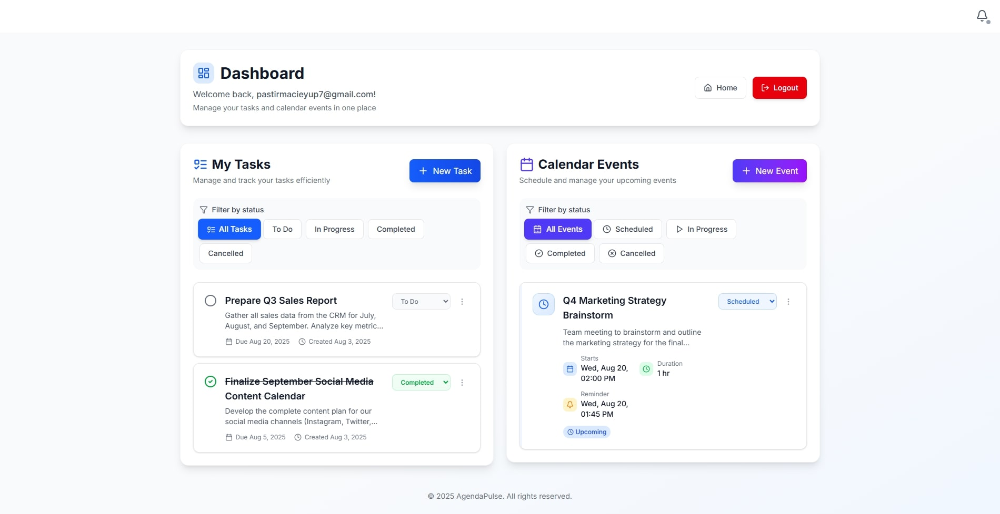

# AgendaPulse

AgendaPulse is a lightweight, self-hosted productivity tool for individuals and small teams to manage calendars, tasks, and notifications.

It is built using a modular microservice architecture and modern frontend technologies.



## 📋 Development Roadmap

### 🎯 **Core Features (MVP)**
- ✅ API Gateway and health checks
- ✅ User authentication (signup/login) with JWT
- ✅ Task management (CRUD + Kafka events)
- ✅ Calendar management (CRUD + Kafka events)
- ✅ Notification delivery system (email, WebSocket)
- ☐ User profiles & preferences (timezone, settings)

### 📱 **User Experience**
- ☐ Categories & tags (organize tasks/events)
- ☐ Search & filters (find tasks/events quickly)

### ⚡ **Productivity Features**
- ☐ Recurring tasks & events (daily, weekly, monthly)
- ☐ Time tracking & estimation
- ☐ Task dependencies (block/unblock workflow)

### 👥 **Collaboration**
- ☐ Team workspaces (shared tasks/calendars)
- ☐ Task assignment & delegation
- ☐ Team calendar visibility
- ☐ Comment system (task/event discussions)

### 📊 **Analytics & Insights**
- ☐ Personal productivity dashboard
- ☐ Completion rate tracking
- ☐ Time spent analytics
- ☐ Export data (CSV, PDF reports)

### 📄 **Documentation**
- ☐ Swagger API documentation
- ☐ Postman API documentation

### 🔧 **DevOps & Production**
- ☐ Docker Compose production setup
- ☐ Basic monitoring (health metrics)
- ☐ Jenkins CI/CD pipeline
- ☐ Database backup automation

---

## 🛠️ Tech Stack

### 🔧 Backend Services

- Java 21, Spring Boot 3.5
- Spring Security, JPA, Actuator
- PostgreSQL (Task & Calendar storage)
- Apache Kafka (Event streaming)
- Spring Cloud Gateway
- Microservices:
  - API Gateway (Service routing & auth)
  - Auth Service (JWT authentication)
  - Task Service (Task management)
  - Calendar Service (Event & reminder management)
  - Notification Service (Email & WebSocket notifications)

### 🎨 Frontend

- Next.js 14 (App Router)
- TypeScript, Tailwind CSS
- NextAuth.js

### 🚀 DevOps

- Docker, Docker Compose
- Jenkins (planned)
- Prometheus, Grafana (planned)

---

## 📋 Requirements

- Java 21+
- Node.js 18+
- PostgreSQL
- Docker & Docker Compose
- Apache Kafka

---

## ⚙️ Configuration Setup

### Backend `application.yml`

Before running the backend services, copy and configure the example application files:

#### 🌐 API Gateway Configuration

```bash
# Navigate to api gateway directory
cd apps/backend/api-gateway

# Copy example configuration
cp src/main/resources/application.example.yml src/main/resources/application.yml
```

#### 🔐 Auth Service Configuration

```bash
# Navigate to auth service directory
cd apps/backend/auth-service

# Copy example configuration
cp src/main/resources/application.example.yml src/main/resources/application.yml
```

#### 📅 Task Service Configuration

```bash
# Navigate to task service directory
cd apps/backend/task-service

# Copy example configuration
cp src/main/resources/application.example.yml src/main/resources/application.yml
```

#### 📅 Calendar Service Configuration

```bash
# Navigate to calendar service directory
cd apps/backend/calendar-service

# Copy example configuration
cp src/main/resources/application.example.yml src/main/resources/application.yml
```

#### 🔔 Notification Service Configuration

```bash
# Navigate to notification service directory
cd apps/backend/notification-service

# Copy example configuration
cp src/main/resources/application.example.yml src/main/resources/application.yml
```

---

### 🎨 Frontend `.env` configuration

Before running the frontend, create your local `.env` file:

```bash
# Navigate to frontend directory
cd apps/frontend/web-ui

# Copy example environment file
cp .env.example .env.local

# Edit with your local settings
```

---

## 🚀 Getting Started

### 1. 💴 Start All Services with Docker Compose

```bash
# Start PostgreSQL, Kafka, Zookeeper, and Kafka UI
cd path/to/project/root

docker-compose up -d
```

### 2. 🔧 Start Backend Services

#### 🔐 Auth Service

```bash
cd apps/backend/auth-service
./mvnw spring-boot:run
```

#### 🌐 API Gateway

```bash
cd apps/backend/api-gateway
./mvnw spring-boot:run
```

#### 📅 Task Service

```bash
cd apps/backend/task-service
./mvnw spring-boot:run
```

#### 📅 Calendar Service

```bash
cd apps/backend/calendar-service
./mvnw spring-boot:run
```

#### 🔔 Notification Service

```bash
cd apps/backend/notification-service
./mvnw spring-boot:run
```

---

### 3. 🎨 Start Frontend

```bash
cd apps/frontend/web-ui
npm install
npm run dev
```

---

## 📄 License

This project is licensed under the MIT License - see the [LICENSE](LICENSE) file for details.

---

## 👥 Authors & Contributors

- **Eyup Pastirmaci** - [@eyuppastirmaci](https://github.com/eyuppastirmaci)

---

## 🤝 Contributions

Feel free to fork and contribute. PRs are welcome!